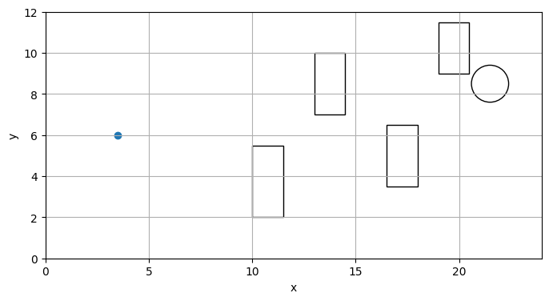
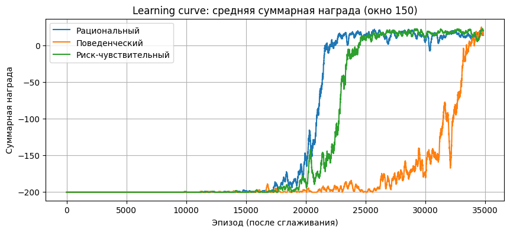
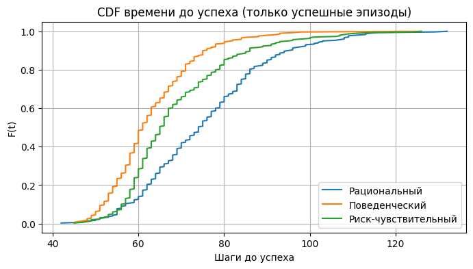
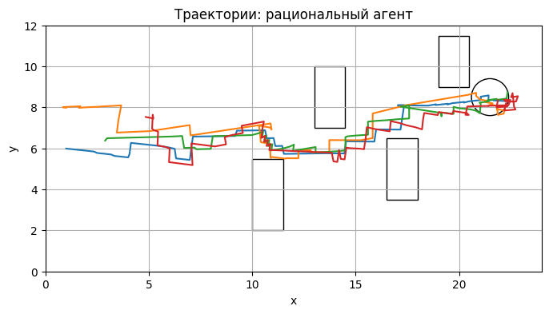
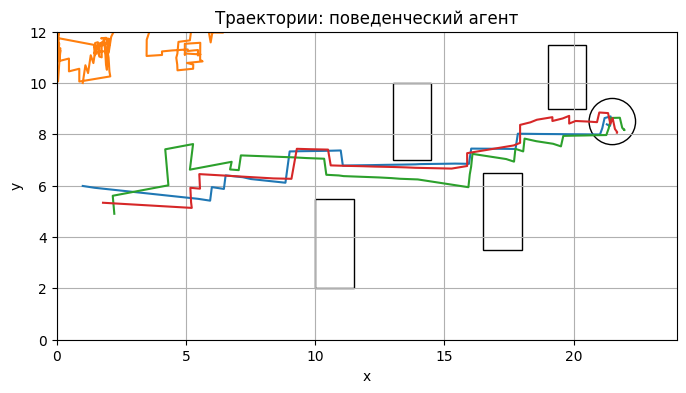
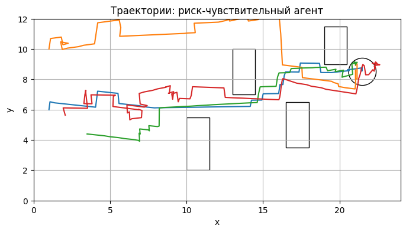
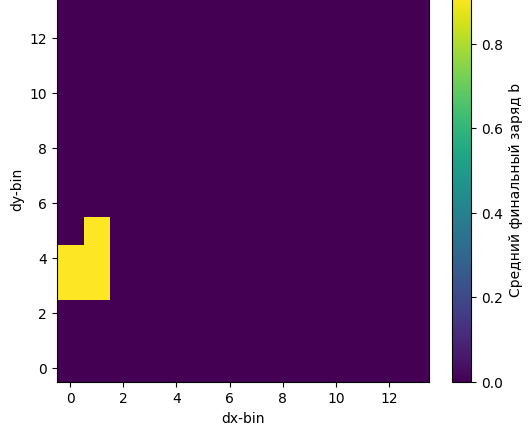
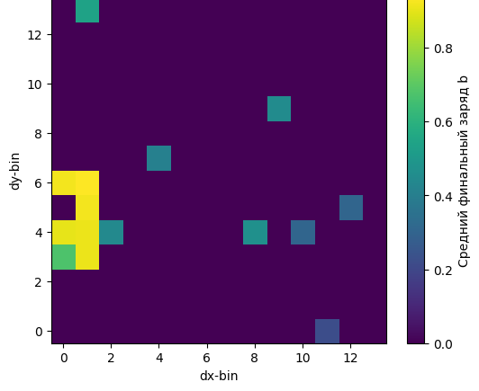
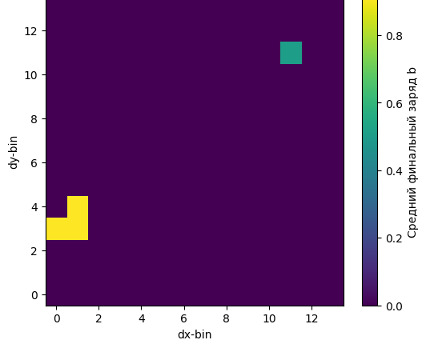

# Drone Navigation with Tabular RL Agents

Исследовательский проект по обучению табличных агентов для навигации автономного дрона в стохастической 2D-среде. Агент должен добраться до станции зарядки с учетом турбулентного ветра, препятствий, расхода батареи и ограничений на успешное завершение эпизода.

В работе сравниваются три подхода к табличному обучению с подкреплением:

- **Rational Q-learning** — базовый табличный Q-learning с `ε-greedy`-стратегией.
- **Prospect Q-learning** — поведенческий агент, преобразующий награду через функцию ценности Prospect Theory.
- **Risk-sensitive Q-learning** — риск-чувствительный агент с энтропийным критерием и устойчивой `logU`-реализацией.

## Дополнительные материалы

[Эссе об актуальности агентного подхода](AGENTS_ESSAY.md) — пояснение, почему агентная постановка подходит для задачи навигации дрона, какие агенты были реализованы и какие действия использовались в среде.

## Постановка задачи

Среда рассматривается как конечный марковский процесс принятия решений `M = (S, A, P, R, γ)`. Непрерывная динамика дрона дискретизируется, чтобы применить табличные методы RL.

**Параметры среды:**

| Компонент | Значение |
|---|---|
| Область движения | `X = [0, 24] × [0, 12]` |
| Станция зарядки | центр `(21.5, 8.5)`, радиус `0.9`, зарядка `0.025` за шаг |
| Начальная позиция | `N((3.5, 6.0), σ²I)`, `σ = 1.8`, с клипом координат |
| Ветер | `wx, wy ~ U(-0.11, 0.11)`, обновление каждые `15` шагов |
| Препятствия | 4 прямоугольных препятствия |
| Скорости | `{0.10, 0.25, 0.40, 0.60}` |
| Действия | 16 действий: 4 направления × 4 скорости |
| Дискретизация | `14 × 14 × 12 × 4 = 9408` состояний |
| Q-таблица | `9408 × 16 = 150528` значений на агента |

Визуализация среды:



Состояние агента имеет вид `(Δx, Δy, b, v)`, где `Δx` и `Δy` — относительное смещение до станции, `b` — нормированный заряд батареи, `v` — наблюдаемая скорость.

**Успех** фиксируется, если дрон находится внутри радиуса станции, заряд батареи больше `0.90`, а время не превышает `140` шагов. **Провал** наступает при разряде батареи ниже `0.04` или достижении лимита `200` шагов.

## Реализованные агенты

| Агент | Идея |
|---|---|
| **Rational Q-learning** | Классическое обновление `Q(s,a)` по TD-цели и выбор действия через `ε-greedy`. |
| **Prospect Q-learning** | Перед обновлением награда преобразуется функцией ценности Prospect Theory: положительные и отрицательные исходы воспринимаются асимметрично. Использованы параметры `αp = 0.88`, `βp = 0.88`, `λp = 2.35`. |
| **Risk-sensitive Q-learning** | Используется энтропийный критерий `U(s,a) = exp(-ηQ(s,a))`. Для численной устойчивости хранится `logU`, а награды масштабируются через `reward_scale = 100`. Основное значение `η = 0.5`. |

## Экспериментальный протокол

| Параметр | Значение |
|---|---:|
| `α` | `0.4` |
| `γ` | `0.99` |
| `ε0` | `1.0` |
| `εmin` | `0.01` |
| Затухание `ε` | `0.997` |
| Тестирование | 300 эпизодов при `ε = 0.005` |
| Seed обучения среды / политики | `0 / 1` |
| Seed тестирования среды / политики | `2 / 3` |
| Seed траекторий среды / политики | `4 / 5` |

Основной протокол на `15000` эпизодах оказался недостаточным: ни один агент не сформировал устойчивую успешную политику. Поэтому дополнительно проведен расширенный диагностический эксперимент на `35000` эпизодах.

## Результаты

### Обучение на 15000 эпизодах

| Агент | Успех, % | Энергия | Коллизии, % | Заход в станцию, % | Мин. дистанция |
|---|---:|---:|---:|---:|---:|
| Rational | 0.00 | 0.536 | 49.00 | 9.67 | 9.940 |
| Prospect | 0.00 | 0.592 | 44.33 | 2.67 | 9.701 |
| Risk-sensitive | 0.00 | 0.563 | 55.67 | 1.00 | 9.459 |

На этом горизонте агенты иногда приближались к станции, но не выполняли полный критерий успеха. Основные причины: редкая терминальная награда, стохастический ветер, препятствия и большая размерность Q-таблицы.

### Обучение на 35000 эпизодах

| Агент | Успех, % | Время успеха | Энергия | Коллизии, % | Заход в станцию, % | Мин. дистанция |
|---|---:|---:|---:|---:|---:|---:|
| Rational | **100.00** | 75.60 | 0.090 | 27.33 | **100.00** | 0.328 |
| Prospect | 95.67 | **63.13** | 0.104 | 31.00 | 97.00 | 0.596 |
| Risk-sensitive | 99.67 | 68.83 | **0.089** | 51.67 | 99.67 | 0.387 |

**Ключевые наблюдения:**

- Rational Q-learning дал максимальную стабильность и достиг `100%` успеха.
- Prospect Q-learning быстрее достигал станции в успешных эпизодах, но расходовал больше энергии.
- Risk-sensitive Q-learning показал минимальный средний расход энергии и почти максимальную успешность, но имел наибольшую долю эпизодов с коллизиями.





### Подбор параметра `η` для risk-sensitive агента

| `η` | Успех, % | Время успеха | Энергия | Коллизии, % | Заход в станцию, % | Мин. дистанция |
|---:|---:|---:|---:|---:|---:|---:|
| `0.5` | **99.67** | 68.83 | **0.089** | 51.67 | 99.67 | 0.387 |
| `1.0` | 99.00 | 69.97 | 0.091 | **22.33** | 99.67 | **0.321** |
| `2.0` | 98.33 | **67.24** | 0.097 | 34.00 | 98.67 | 0.431 |

Для основного сравнения выбрано `η = 0.5`, так как этот вариант дал лучший баланс успешности и среднего расхода энергии.

## Траектории и карты финального заряда

После расширенного обучения агенты находят маршруты к станции через область с препятствиями. Различия в траекториях связаны с тем, что агенты используют разные критерии оценки последствий действия.

| Rational | Prospect | Risk-sensitive |
|---|---|---|
|  |  | 

Карты финального заряда показывают, в каких дискретных областях заканчиваются эпизоды и какой заряд остается у агента.

| Rational | Prospect | Risk-sensitive |
|---|---|---|
|  |  |  |

## Статистический анализ

Welch t-test показал, что различия по времени успеха статистически значимы для всех пар агентов (`p < 0.05`). По расходу энергии Rational и Risk-sensitive статистически не различаются, тогда как Prospect отличается от обоих агентов и расходует больше энергии.

| Сравнение | Метрика | `p-value` | Вывод |
|---|---|---:|---|
| Rational vs Prospect | время успеха | `3.79e-28` | различие значимо |
| Rational vs Risk-sensitive | время успеха | `9.49e-09` | различие значимо |
| Prospect vs Risk-sensitive | время успеха | `1.09e-08` | различие значимо |
| Rational vs Prospect | энергия | `0.0064` | различие значимо |
| Rational vs Risk-sensitive | энергия | `0.7331` | различие незначимо |
| Prospect vs Risk-sensitive | энергия | `0.0062` | различие значимо |

## Как запустить

```bash
pip install numpy matplotlib scipy jupyter
jupyter notebook drone-navigation-tabular-rl.ipynb
```

## Выводы

Работа показывает, что задача навигации дрона в стохастической sparse-reward среде решаема табличными методами, но требует достаточного числа обучающих эпизодов. При `15000` эпизодах агенты не успевают сформировать устойчивую успешную политику, а при `35000` эпизодах все три подхода демонстрируют высокую успешность.

Наиболее стабильным оказался Rational Q-learning, самым быстрым в успешных эпизодах — Prospect Q-learning, а наиболее энергоэффективным — Risk-sensitive Q-learning. Различия между агентами отражают влияние критерия оптимальности на траектории, расход энергии и устойчивость поведения.

## Возможные направления развития

- reward shaping для ускорения распространения полезного сигнала;
- eligibility traces или Dyna-Q для более быстрой сходимости;
- аппроксимация функции ценности вместо полной Q-таблицы;
- отдельная оптимизация штрафов за коллизии и расход батареи;
- расширенная серия запусков с доверительными интервалами по нескольким seed.
